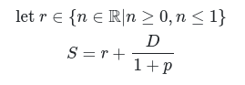

# Chosen One
Choose participants.

## Selection Algorithm
Chosen One selects participants by accepting a list of Participants.
A Participant has 3 properties:
- Score
- Presentation Count
- Name

The algorithm goes through each participant and adds a small random number to it, then
it adds ten over the previous presentation count plus one. The presentation count
is the previous amount of times each participant has presented. This compensates for
an issue where a presenter could be selected multiple times; the greater the presentation
count, the less likely you are to be chosen.

The algorithm can be described with

where D is the team distribution factor (limiting one person being chosen twice),
and p is the previous presentation count of the participant.
